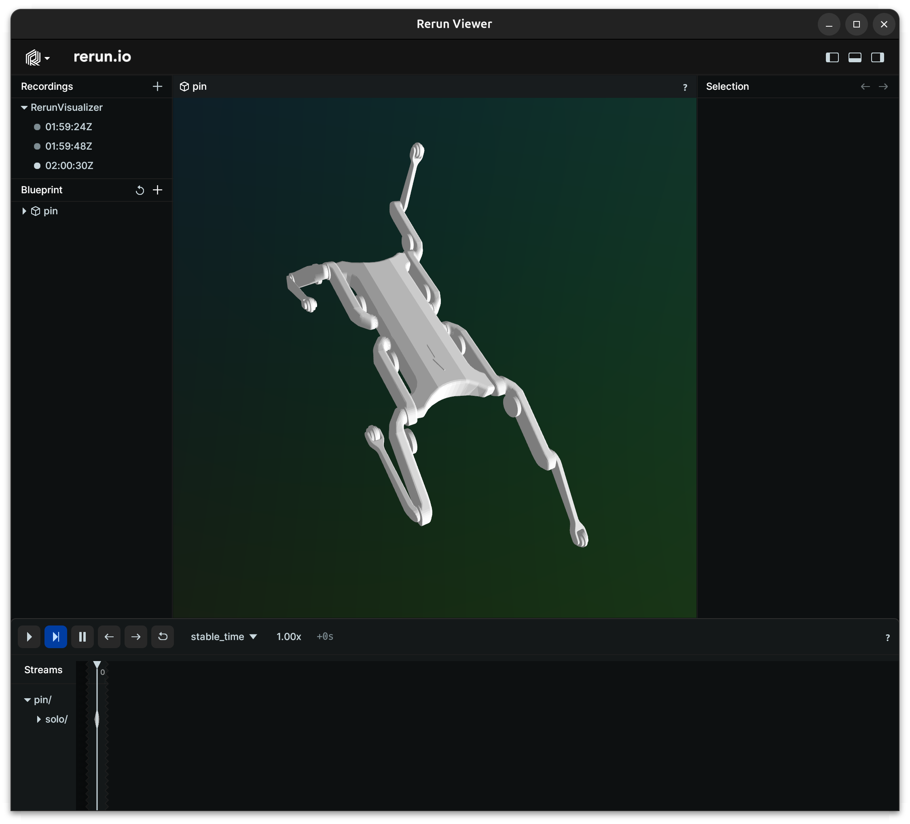

# pinocchio-rerun

This is a renderer project for Pinocchio based on [rerun](https://github.com/rerun-io/rerun).



## Quickstart

This project requires [Pinocchio](https://github.com/stack-of-tasks/pinocchio) and [Assimp](https://github.com/assimp/assimp) (Pinocchio and HPP-FCL would suffice).

The Rerun viewer needs to be installed for visualizations to work. Follow their [Getting Started](https://github.com/rerun-io/rerun/tree/main#getting-started) to see how to install it.

Moreover, this requires the [Rerun C++ SDK](https://www.rerun.io/docs/getting-started/quick-start/cpp). It can be installed from conda-forge as follows:

```bash
conda install -c conda-forge librerun-sdk
```

### Compiling from source

Compiling this from source using CMake:

```bash
mkdir build && cd build
cmake .. -DCMAKE_PREFIX_PATH=<your/prefix/here> -DCMAKE_INSTALL_PREFIX=<your/prefix/here>
cmake --build . --target install
```

When building against conda, you can typically use the environment variables `$CONDA_PREFIX` as your prefix.
